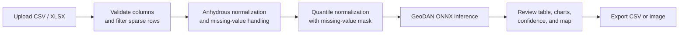

# Basalt Tectonic Setting Discrimination — Web Application

> A browser-based research tool for classifying basalt samples into **nine
> tectonic settings** from major- and trace-element geochemistry.
>
> The application combines data validation, missing-value handling, anhydrous
> normalization, ONNX inference, statistical summaries, and map visualization
> in a single Vue interface. Sample compositions are processed locally in the
> browser and are not uploaded to an application server.


---

## 1. Overview

This repository contains the frontend application for the GeoDAN basalt
tectonic-setting discrimination workflow. It accepts CSV or XLSX sample tables,
prepares the geochemical features, and runs a dual-stream ViT–Transformer model
through ONNX Runtime Web.

The model uses 36 major- and trace-element features together with an explicit
missing-value mask. Each sample is assigned the highest-probability class and a
confidence score. Results can then be reviewed in a table, summarized with
interactive charts, displayed on a map when coordinates are available, and
exported for further analysis.

---

## 2. Main Features

- **Browser-local processing:** geochemical data and model inference remain in
  the user's browser.
- **CSV and XLSX import:** required element columns are matched
  case-insensitively; LOI and geographic coordinates are optional.
- **Integrated preprocessing:** sparse-row filtering, duplicate removal,
  anhydrous normalization, missing-value encoding, imputation, and quantile
  normalization.
- **Nine-class prediction:** browser-side ONNX inference returns the predicted
  tectonic setting and confidence for every retained sample.
- **Result exploration:** sortable tables, class and confidence statistics,
  spatial filters, sample popups, and multiple basemaps.
- **Export tools:** processed prediction CSV, spatial CSV, result summary, and
  map screenshot.
- **Bilingual interface:** Chinese and English can be switched directly in the
  application.

---

## 3. Workflow



For modern basalt samples, the application uses a lightweight global
MissForest model and falls back to KNN if the model cannot be loaded. For
recognized Archean/cratonic datasets, missing entries are encoded without
modern-basalt imputation to reduce the risk of introducing modern-domain
information.

---

## 4. Input Data

The input file must contain a header row and the following 36 model features.
Major elements use `WT%`, while trace elements use `PPM`.

| Group | Required columns |
|---|---|
| Major elements | `NA2O`, `MGO`, `AL2O3`, `SIO2`, `P2O5`, `K2O`, `CAO`, `TIO2`, `MNO`, `FEOT` |
| Trace elements | `RB`, `V`, `CR`, `CO`, `NI`, `BA`, `SR`, `Y`, `ZR`, `NB`, `LA`, `CE`, `PR`, `ND`, `SM`, `EU`, `GD`, `TB`, `DY`, `HO`, `ER`, `YB`, `LU`, `HF`, `TA`, `TH` |

Use headers such as `SIO2(WT%)` and `ZR(PPM)`. `LOI(WT%)` is optional and is
treated as zero when absent.

Coordinates are also optional. When included, the application recognizes:

- latitude: `LATITUDE`, `LAT`, or `Y`;
- longitude: `LONGITUDE`, `LON`, `LONG`, or `X`.

Example datasets are available under [`public/data`](public/data) and can also
be downloaded from the application's quick-start panel.

---

## 5. Output Classes

The model predicts one of the following tectonic settings:

1. `CONTINENTAL_RIFT`
2. `OCEAN ISLAND`
3. `SPREADING_CENTER`
4. `Island arc`
5. `CONTINENTAL FLOOD BASALT`
6. `OCEANIC PLATEAU`
7. `BACK-ARC_BASIN`
8. `Intra-oceanic arc`
9. `Continental arc`

The exported result table includes the processed geochemical fields,
`Predicted_Setting`, and `Confidence`. Predictions are intended as a
quantitative screening aid and should be interpreted together with geological,
petrographic, and isotopic evidence.

---

## 6. Project Structure

```text
tectonic_setting_discrimination_front_V2/
├── public/
│   ├── data/                         # Downloadable example datasets
│   ├── model/                        # ONNX model and preprocessing assets
│   └── *.png / *.jpg                 # Static application images
├── scripts/                          # Model and preprocessing export utilities
├── src/
│   ├── components/
│   │   └── BasaltDiscrimination/     # Main workspace, charts, map, and inference
│   ├── docs/                         # In-application Chinese and English help
│   ├── i18n/                         # Internationalization setup
│   ├── locales/                      # Interface translations
│   ├── App.vue
│   └── main.js
├── index.html
├── package.json
└── vite.config.js
```

The browser model depends on the assets in `public/model/`, including
`model.onnx`, model metadata, quantile parameters, missing-value models, and
the KNN reference dataset. Keep these files together when deploying the built
application.

---

## 7. Installation and Local Development

Node.js 18 or later is recommended.

```bash
git clone https://github.com/jiunuan/tectonic_setting_discrimination_front_V2.git
cd tectonic_setting_discrimination_front_V2
npm install
npm run dev
```

The development server is configured for `http://127.0.0.1:5174`.

Available commands:

| Command | Purpose |
|---|---|
| `npm run dev` | Start the Vite development server |
| `npm run dev:force` | Start Vite and rebuild the dependency cache |
| `npm run build` | Create a production build in `dist/` |
| `npm run preview` | Preview the production build locally |
| `npm run deploy` | Publish `dist/` with `gh-pages` |

---

## 8. Deployment and Notes

The Vite base path is configured as
`/tectonic_setting_discrimination_front_V2/` for GitHub Pages. To build and
deploy the application:

```bash
npm run build
npm run deploy
```

Model inference and sample preprocessing do not require a Python backend.
Internet access may still be used to load public basemap tiles in the spatial
view. Map services receive map requests only; uploaded geochemical
compositions are not transmitted.

For the complete training, evaluation, interpretation, and Archean-application
workflow, see the related
[basalt tectonic discrimination repository](https://github.com/jiunuan/tectnoic_setting_discrimination).
